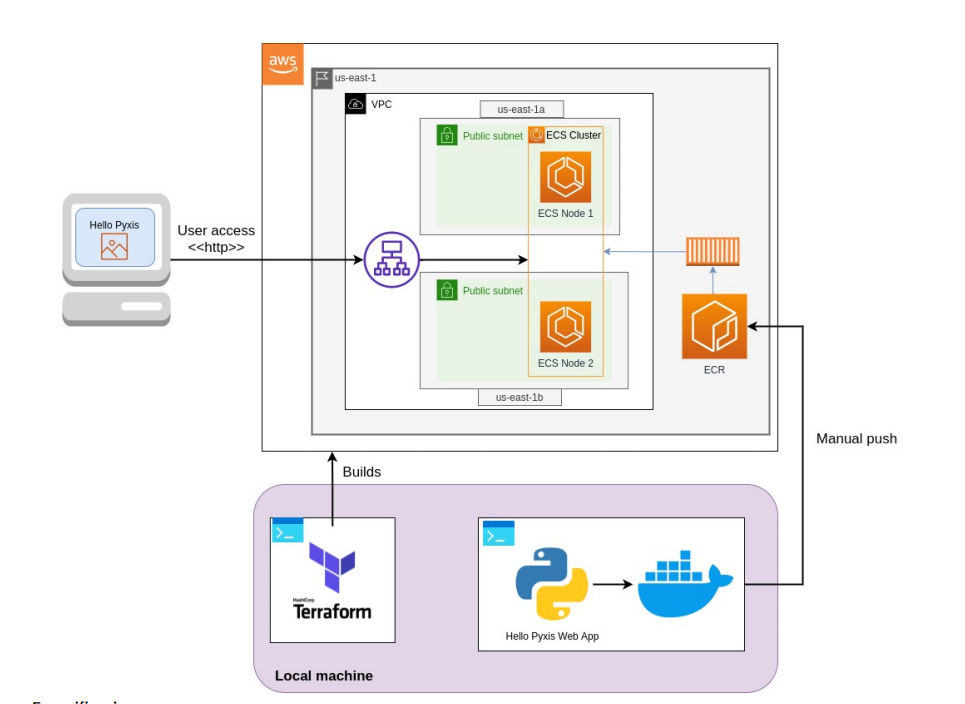

# Amazon ECS Cluster

This is the example of creating a simple infrastructure using Terraform and AWS cloud provider. It consists of:
- Virtual Private Cloud (VPC) with 2 public subnets in 2 availability zones
- Elastic Container Service (ECS)
- Application Load Balancer (ALB)

## Creating the infrastructure

This example requires that you have AWS account and Terraform CLI installed.

1. `git clone https://github.com/sanhidalgoo/ecs_cluster.git`
2. `cd ecs_cluster/src`
3. `terraform init`
4. `terraform plan`
5. `terraform apply -target aws_ecr_repository.pyxis-app`
6. Make a manual push to ECR of your docker image (In this case [pyxis-app](pyxis-app)). See the commands in the AWS console.
7. `terraform apply`

